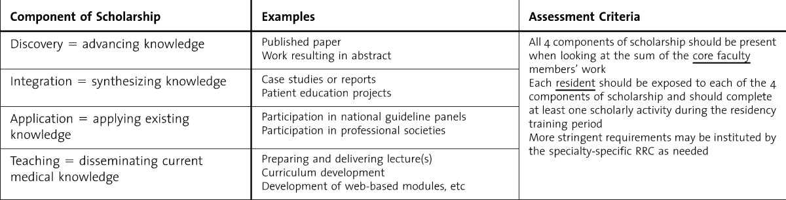

# Academician

An academic is a person who is engaged in scholarly activities, often but not necessarily within a higher education institution. Academics are typically involved in teaching, research, and other intellectual pursuits related to their field of expertise.

## Scholarly Activities

Scholarly activities refer to intellectual pursuits that contribute to the advancement of knowledge within a particular academic discipline. These activities include conducting research, publishing scholarly articles or books, presenting findings at conferences, and engaging in critical discourse with peers. Scholars often aim to contribute new insights, theories, or perspectives to their field through rigorous and systematic inquiry.

Scholarly activities are essential in advancing the field of academia and fostering intellectual growth. They encompass a wide range of pursuits that contribute to the expansion and dissemination of knowledge within various disciplines. Below, we will explore scholarly activities in detail, focusing on four primary categories: discovery, integration, application, and teaching.

### Discovery: Advancing Knowledge

The discovery category involves activities that contribute to the creation of new knowledge through rigorous research and investigation. These activities often result in the publication of original research articles, books, or reports that present novel findings or theories. Scholars in this category aim to push the boundaries of their fields by asking critical questions, developing innovative methodologies, and exploring uncharted territories.

Examples of scholarly activities in the discovery category include:

- Publishing original research articles in peer-reviewed journals
- Writing and publishing books or monographs that present new insights or theories
- Presenting research findings at academic conferences
- Participating in research collaborations with other scholars

### Integration: Synthesizing Knowledge

Integration involves the synthesis of existing knowledge to create new perspectives, frameworks, or models. Scholars in this category engage in activities that combine different bodies of knowledge, identify patterns and relationships, and generate novel interpretations. This type of scholarly activity often results in the production of case studies, reports, or literature reviews.

Examples of scholarly activities in the integration category include:

- Conducting comprehensive literature reviews to identify trends, gaps, or inconsistencies in existing research
- Developing case studies that explore complex phenomena or situations from multiple perspectives
- Creating conceptual frameworks or models that integrate diverse theories or perspectives
- Writing book reviews or commentaries that synthesize the key arguments and contributions of published works

### Application: Applying Existing Knowledge

Application involves the practical application of existing knowledge to address real-world problems or challenges. Scholars in this category engage in activities that apply theories, methods, or findings from their disciplines to solve problems, inform policy, or improve practice.

Examples of scholarly activities in the application category include:

- Participating in professional societies or organizations that apply academic knowledge to real-world issues
- Developing educational materials or resources that translate complex concepts into accessible formats for practitioners or the general public
- Collaborating with industry partners or government agencies to inform policy or practice based on academic research
- Conducting evaluations or assessments of programs, policies, or interventions to determine their effectiveness and identify areas for improvement

### Teaching: Disseminating Current Knowledge

Teaching involves the dissemination of current knowledge to students, colleagues, or the broader public. Scholars in this category engage in activities that share their expertise and facilitate learning through the development of curricula, lectures, or other educational materials.

Examples of scholarly activities in the teaching category include:

- Designing and delivering lectures or courses that introduce students to key theories, concepts, and methods in a particular field
- Developing and implementing curricula or educational programs that address specific learning objectives or goals
- Creating web-based learning modules or resources that provide accessible and engaging instruction on specific topics or issues
- Participating in professional development activities or workshops to enhance teaching skills and stay current with best practices in education

In conclusion, scholarly activities are crucial in advancing knowledge, fostering intellectual growth, and addressing real-world problems. By engaging in discovery, integration, application, and teaching activities, scholars contribute to the ongoing development and dissemination of knowledge within their respective disciplines.