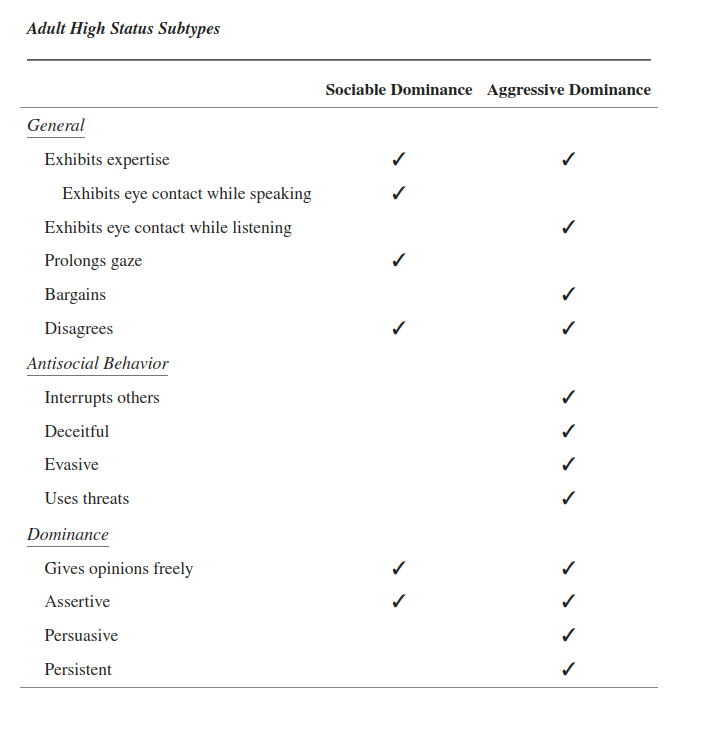

# Understanding Social Hierarchies: The Neural and Psychological Foundations of Status Perception

<https://www.ncbi.nlm.nih.gov/pmc/articles/PMC5494206/>

From childhood sports competitions and spelling bees, to grade point averages and prom kings and queens, we learn early in life to view our social world in terms of who is better, smarter, or more favored than everyone else. Even as adults, we are quick to identify status symbols such as foreign cars, big houses, and career titles.

We would expect, then, that humans are equipped with mechanisms for rapidly perceiving status information and recognizing their relative status roles, and that sensitivity to status information is present early in life. However, the neural mechanisms underlying status perception and judgment in humans are only recently gaining attention, and findings remain relatively vague. Even sparser is research regarding the effects of neural maturation on status perception, and how developmental changes in status processing influence the value and impact of social rank.

Dominance is associated with the ability to acquire resources and therefore can be a predictor of power and a means of establishing status across species. Thus, dominance can be viewed as a behavior or personality trait that leads to inequalities in power among group members, and thereby differentiates status.

Dominance may be best divided into two subscales: sociable dominance and aggressive dominance (Kalma et al., 1993). Individuals who score higher on sociable dominance tend to have better peer relations and are more socially oriented in their behavior, while those who score high on aggressive dominance are more selfish and exhibit more antisocial behaviors. It is important to note that, while positive social behavior may help a group or an individual (via association with others) to achieve status, it does not necessarily imply that dominant behavior is not present; in fact, scoring high on measures of both sociable and aggressive dominance may be optimal.

Alternatively, aggression might not be necessary at all; rather, the individuals who attain high status can do so by making themselves appear valuable to the group, and acting confidently and generously toward others

For instance, there may be two opposing means of establishing status among humans: through displays of dominance, or displays of prestige. Contrary to the aggression and force characteristic of social dominance, individuals demonstrating prestige attain status by demonstrating their competence, knowledge, or skill.

## Social dominance theory

<https://en.wikipedia.org/wiki/Social_dominance_theory>

SDT adds new theoretical elements attempting a comprehensive synthesis of explanations of the three mechanisms of group hierarchy oppression that are regulated by legitimizing myths:

- Aggregated individual discrimination (ordinary discrimination)

- Aggregated institutional discrimination (by governmental and business institutions)

  - State terrorism (e.g., police violence, death squads)

- Behavioural asymmetry
  - Deference–systematic outgroup favouritism (minorities favour members of dominant group)
  - asymmetric ingroup bias (as status increases, in-group favoritism decreases)
  - self-handicapping (self-categorization as an inferior becomes a self-fulfilling prophecy)
  - ideological asymmetry (as status increases, so do beliefs legitimizing and/or enhancing the current social hierarchy)   