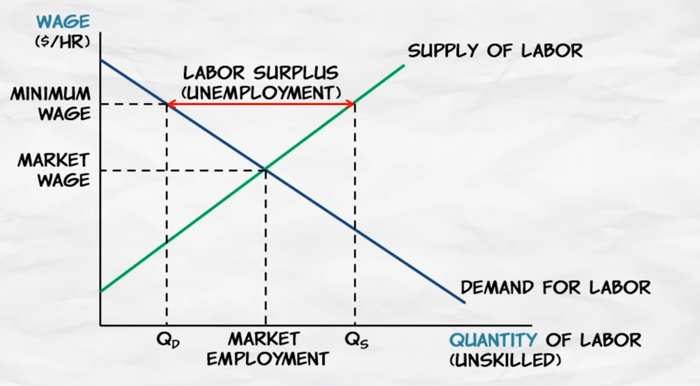

# Does price floor works?

A price floor is a minimum price allowed by law. That is, it is a price below which it is illegal to buy or sell, called a price floor because you cannot go below the floor. We're going to show that price floors create four significant effects: surpluses, lost gains from trade, wasteful increases in quality, and a misallocation of resources. 

## What is surplus of labor with mininum wage? Unemployment
The minimum wage is a price floor, so it's going to create a surplus. A surplus of labor, we call what? A surplus of labor is called unemployment.

<iframe width="560" height="315" src="https://www.youtube.com/embed/65kfAswiHLk?si=OHAGZA5EB5T6TzEk" title="YouTube video player" frameborder="0" allow="accelerometer; autoplay; clipboard-write; encrypted-media; gyroscope; picture-in-picture; web-share" allowfullscreen></iframe>

[Course Link mru.org](https://mru.org/courses/principles-economics-microeconomics/price-floor-example-minimum-wage)

## Now, who will the minimum wage affect? 

Now, who will the minimum wage affect? Workers with very high productivity who are already earning more than the minimum wage – they are not going to be affected by the minimum wage perhaps at all. Instead, it will affect the least experienced, least educated, least trained workers. Low-skilled teenagers, for example, are most likely to be affected by the minimum wage. 

## Modest increase in minimum wage

Now the minimum wage is a controversial and hotly debated issue. Some academic results indicate that the unemployment effect of a modest increase in the minimum wage would not be substantial. At the same time, however, we also have to recognize that a modest increase in the minimum wage would not have big benefits either. First, only a small percentage of workers are going to be affected by the minimum wage. 97% or so of workers already earn more than the minimum wage.

## Large increase in the minimum wage

So a large increase in the minimum wage is going to cause serious unemployment, and the good example of this is Puerto Rico in 1938. Congress actually set the first minimum wage at this time at 25 cents an hour. Now that may seem low, but that's at a time when the average wage in the United States was still less than a dollar an hour, was 62 and a half cents an hour. Congress, however, forgot to exempt Puerto Rico, when the average wages in Puerto Rico at that time were much lower than in the rest of the United States, only three cents to four cents an hour.
And lots of Puerto Rican firms went bankrupt, it created devastating unemployment. In fact, Puerto Rican politicians came to Washington to beg for an exemption to get them out of the minimum wage. So, a large increase in the minimum wage would certainly cause substantial and serious unemployment.

We do see higher minimum wages in other countries. The minimum wage in France is higher than the U.S., relative to average wages in those two countries. In addition, labor laws in France make it very difficult to fire workers once they have been hired. As a result, firms in France are very reluctant to hire new workers.

Younger workers are especially affected because they are less productive, and also they are less known commodities. So, the risk of hiring them is greater. As a result, unemployment among young workers is very high in France. It was 23% in 2005, and that was long before the economic crisis, the financial crisis affecting the entire world. So even during good times, unemployment in France among young workers is very high, because the minimum wage is high, and because firms don't want to hire, given how difficult it is to fire workers.

## Why do governments enact price controls?

So far, we've looked at a number of the consequences of price controls, both price ceilings and price floors. And most of the consequences, they're not very good.i

<iframe width="560" height="315" src="https://www.youtube.com/embed/1GviwAknP08?si=EzG7pP25OhwX-LzW" title="YouTube video player" frameborder="0" allow="accelerometer; autoplay; clipboard-write; encrypted-media; gyroscope; picture-in-picture; web-share" allowfullscreen></iframe>

## Public simply did not connect wage and price controls with their consequences

In November of 1972, Nixon won re-election in a landslide. So, wage and price controls were popular. Nixon was re-elected with this policy as well as with others. Now, why is this? I think in many cases, in a majority of cases, the public simply did not connect wage and price controls with their consequences. So, looking around and the shortages, the long line-ups for gasoline, they didn't say the cause of that is the price control.

## Price floor in agriculture

[Price floors are also used often in agriculture to try to protect farmers](http://economics.fundamentalfinance.com/micro_price-floor.php).

As you might have guessed, this creates a problem. There is less quantity demanded (consumed) than quantity supplied (produced). This is called a surplus. If the surplus is allowed to be in the market then the price would actually drop below the equilibrium. In order to prevent this the government must step in. The government has a few options:

 1. They can buy up all the surplus. For a while the US government bought grain surpluses in the US and then gave all the grain to Africa. This might have been nice for African consumers, but it destroyed African farmers.

 2. They can strictly enforce the price floor and let the surplus go to waste. This means that the suppliers that are able to sell their goods are better off while those who can't sell theirs (because of lack of demand) will be worse off. Minimum wage laws, for example, mean that some workers who are willing to work at a lower wage don't get to work at all. Such workers make up a portion of the unemployed (this is called "structural unemployment").

3. The government can control how much is produced. To prevent too many suppliers from producing, the government can give out production rights or pay people not to produce. Giving out production rights will lead to lobbying for the lucrative rights or even bribery. If the government pays people not to produce, then suddenly more producers will show up and ask to be payed.

4. They can also subsidize consumption. To get demanders to purchase more of the surplus, the government can pay part of the costs. This would obviously get expensive really fast.

## Implementing MSP in India

[In India, 6.7 million children are going without food](https://www.indiatoday.in/health/story/india-has-67-million-zero-food-children-going-without-food-harvard-study-2513449-2024-03-11), and the question is whether a price floor can still create a surplus. Surplus occurs not because there are not enough people who need the product, but because enough people fail to purchase it at a particular price. At a price floor, there will be far more people who fail to purchase it as the quantity supplied exceeds the quantity demanded, as shown in the diagram.

## So price floor is a bad idea. In what way we can protect farmers?

Todo!
     
